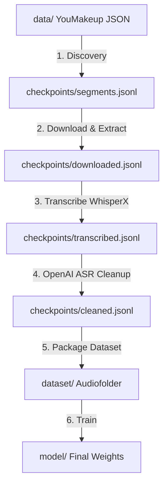

# MakeUP AI — STT Training Data Pipeline

A robust, checkpoint-aware pipeline to build and fine-tune domain-specific Whisper speech-to-text models on the **YouMakeup** dataset. 

This repository coordinates the extraction of makeup instruction clips from YouTube, transcription, AI-powered domain cleanup, dataset packaging, and Whisper fine-tuning.

---

## Architecture & Workflow

The pipeline runs in five automated, checkpoint-driven phases. It is designed to be resilient, automatically resuming from the last successfully processed item if interrupted.



### 1. Discovery (`agents/1-discovery.js`)
Reads the YouMakeup dataset JSON step annotations, samples a configured number of videos using a reproducible seeded shuffle, and seeds the splits (70% Train, 15% Validation, 15% Test). Outputs discovered video steps to `checkpoints/segments.jsonl`.

### 2. Download & Extract (`agents/2-extractor.js`)
Downloads YouTube audio streams using `yt-dlp`, converts them to WAV, and trims the annotated instruction segments into individual 16kHz mono WAV clips using `ffmpeg`. Tracks successful extractions in `checkpoints/downloaded.jsonl` and logs failed/deleted videos to `checkpoints/failed.jsonl`.

### 3. Transcribe (`agents/3-transcriber.py`)
Loads a WhisperX model to transcribe all segments. WhisperX uses word-level forced alignment to generate precise timestamps and word boundaries. Transcription results are written to `checkpoints/transcribed.jsonl`.

### 4. Cleanup (`agents/4-cleanup.js`)
Uses OpenAI's API (default: `gpt-4o-mini`) to correct domain-specific terminology (e.g., brand names, facial anatomy, makeup products, and application tools) in the raw transcripts. The cleanup agent fixes spelling mistakes and spacing errors (e.g., `"eye liner"` &rarr; `"eyeliner"`, `"under eye"` &rarr; `"under-eye"`) while strictly preserving sentence structures and content. Results are written to `checkpoints/cleaned.jsonl`.

### 5. Package (`orchestrator.js` packaging phase)
Copies trimmed audio files and compiles their corresponding transcripts into Hugging Face `audiofolder` splits: `train/`, `val/`, and `test/`. Each directory contains a `metadata.jsonl` file mapping audio file paths to their transcription labels.

---

## Directory Structure

```
├── agents/
│   ├── 1-discovery.js        # samples annotation files & determines splits
│   ├── 2-extractor.js        # coordinates yt-dlp downloading & ffmpeg trimming
│   ├── 3-transcriber.py      # WhisperX transcription & forced alignment
│   └── 4-cleanup.js          # OpenAI-powered domain vocabulary correction
├── checkpoints/              # Checkpoint files allowing phase recovery
│   ├── segments.jsonl        # Discovered dataset segments
│   ├── downloaded.jsonl      # Trimming & download records
│   ├── transcribed.jsonl     # Raw WhisperX transcripts
│   ├── cleaned.jsonl         # AI-cleaned, final transcripts
│   └── failed.jsonl          # Skipped / error entries
├── dataset/                  # Packaged Hugging Face Audiofolder (Created)
│   ├── train/                # metadata.jsonl + audio/*.wav
│   ├── val/                  # metadata.jsonl + audio/*.wav
│   └── test/                 # metadata.jsonl + audio/*.wav
├── utils/                    # Shared utility files (checkpoints, logs, retries)
├── validate.js               # Validates the packaged dataset integrity
├── train.py                  # Fine-tuning script for Whisper models
├── requirements.txt          # Python dependencies
└── package.json              # Node.js dependencies and run scripts
```

---

## Installation & Prerequisites

### System Requirements (Must be installed globally)
1. **yt-dlp**: Download stream handler (`pip install yt-dlp`).
2. **ffmpeg**: Audio converter and trimmer (`apt install ffmpeg` / `brew install ffmpeg`).
3. **CUDA GPU**: Highly recommended. Processing transcription and training on CPU is extremely slow.

### Repository Setup
Clone the repository and install both Node.js and Python dependencies:

```bash
# Install Node packages
npm install

# Install Python packages
pip install -r requirements.txt
```

### Environment Configuration
Copy `.env.example` to `.env` and configure your API keys and parameters:

```bash
cp .env.example .env
```

**Key Environment Variables in `.env`:**
* `OPENAI_API_KEY`: Required for the Phase 4 Claude/GPT transcript correction.
* `WORKERS`: Number of parallel `yt-dlp` download workers (default: `2`).
* `WHISPER_MODEL`: Model used for transcription (default: `large-v3`).
* `DEVICE`: Run device (`cuda` or `cpu`, default: `cuda`).
* `TARGET_VIDEOS`: Total video samples to extract (default: `1000`).
* `SEED`: Seed for reproducible splits (default: `42`).

---

## Execution Guide

### Running the Entire Pipeline
To process the entire pipeline sequentially:
```bash
npm start
# or: node orchestrator.js
```

### Running Individual Phases
You can execute specific phases of the orchestrator individually:
```bash
npm run download    # Phase 1 & 2: Discover and download/trim WAVs
npm run transcribe  # Phase 3: Run Python WhisperX batch transcriber
npm run cleanup     # Phase 4: Run OpenAI ASR cleaning
npm run package     # Phase 5: Build final Hugging Face audio folder splits
```

### Validating Dataset Integrity
Before running training, verify that the dataset splits and metadata are correct and the WAV files exist:
```bash
npm run validate
# or: node validate.js
```

---

## Whisper Fine-Tuning

The `train.py` script fine-tunes a Whisper model (e.g., `openai/whisper-small`) on your packaged dataset.

### Robust Training Features
- **Text Normalization:** Lowercases text and strips punctuation prior to evaluation to ensure calculated Word Error Rate (WER) represents true semantic accuracy rather than formatting mismatch.
- **Auto-Recovery:** Detects existing local training progress. If the runtime fails or disconnects (e.g., on Google Colab), it can restore checkpoints from a Google Drive or other durable backup directory.
- **Memory Optimization:** Uses PyTorch 2.0+ scaled dot product attention (`sdpa`), garbage collection, and CUDA cache resetting to avoid Out-Of-Memory (OOM) errors.

### Training Usage
```bash
python train.py \
    --model openai/whisper-small \
    --dataset ./dataset \
    --output ./model \
    --steps 4000 \
    --batch 8 \
    --grad-accum 2 \
    --lr 5e-6 \
    --backup-dir /content/drive/MyDrive/makeup-stt/checkpoints
```

### Command Line Arguments
* `--model`: Base Whisper model or path to local checkpoint (default: `openai/whisper-small`).
* `--dataset`: Directory of your packaged `audiofolder` dataset (default: `./dataset`).
* `--output`: Path to write local models and logs (default: `./model`).
* `--steps`: Maximum training steps (default: `4000`).
* `--batch`: Batch size per GPU (default: `8`).
* `--grad-accum`: Gradient accumulation steps (default: `2`).
* `--lr`: Learning rate (default: `5e-6`).
* `--hub-id`: Optional Hugging Face Hub repository identifier.
* `--backup-dir`: Optional directory to copy and synchronize checkpoints (e.g. durable cloud storage).
